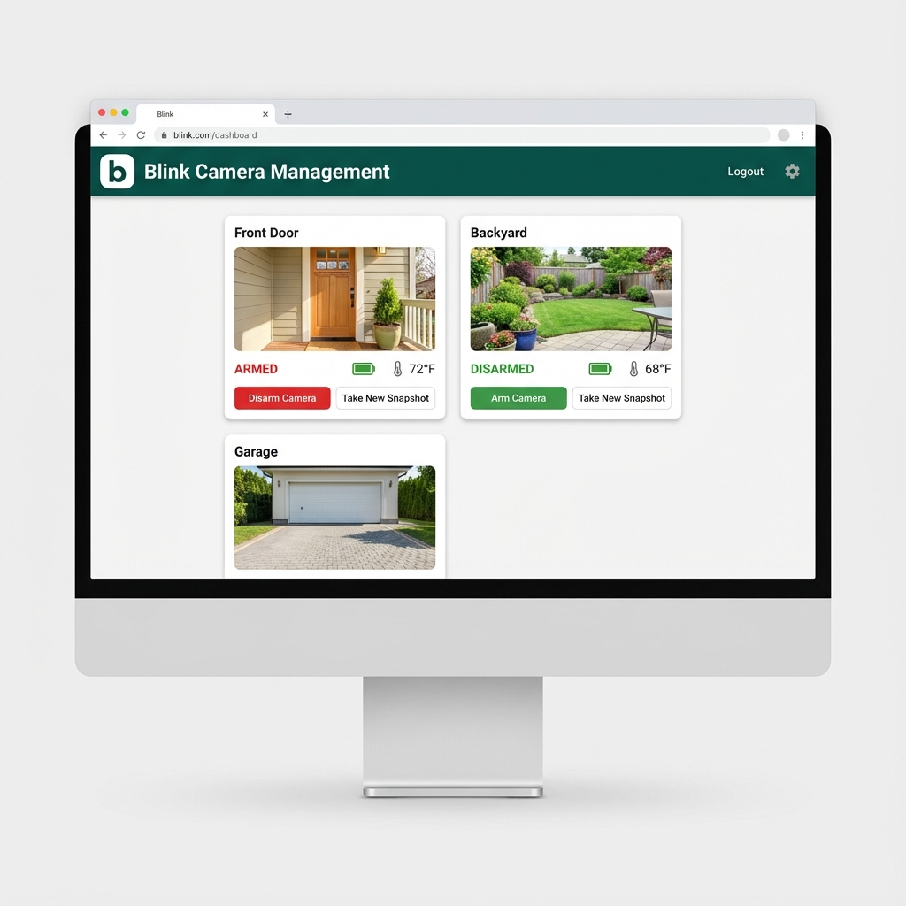

# Blink Camera Management System https://blinkforhome.com/
# AI-Enabled-blink-camera-app

# Development by: Glenn Mossy
# using Google Antigravity IDE with AI assistance

A web application to manage Blink security cameras in your home.



## 🎉Components Status(November 2025)

| Component | Status | Details |
|-----------|--------|---------|
| **API Endpoint** | ✅ Fixed | Now using `rest-prod.immedia-semi.com` with OAuth |
| **DNS Resolution** | ✅ Working | Resolves to `18.165.83.18` |
| **Backend Server** | ✅ Running | Flask API on port 5000 |
| **Frontend Server** | ✅ Running | React app on port 3000 |
| **blinkpy Version** | ✅ Updated | 0.24.1 (async/await API) |
| **Authentication** | ⚠️ 2FA Required | Blink requires two-factor authentication |

**See [UPGRADE_SUMMARY.md](UPGRADE_SUMMARY.md) for complete technical details.**

## Setup

### Prerequisites
- Python 3.11.9 (managed via pyenv). Only use 3.11.9 for now due to dependency issues with blinkpy
- Node.js and npm
- Blink camera account

### 1. Install Python Dependencies

Create a virtual environment and install packages:
```bash
python -m venv .venv
source .venv/bin/activate  # On Windows: .venv\Scripts\activate
pip install -r requirements.txt
```

### 2. Configure Environment Variables
 
 Create a `.env` file with your Blink credentials:
 ```
 BLINK_USERNAME=your_email@example.com
 BLINK_PASSWORD=your_password
 FLASK_SECRET_KEY=your_secret_key_here
 ```
 
 **Alternatively**, you can configure your credentials directly in the web application by clicking the **Settings (Gear Icon)** in the top right corner.
 
 **Note**: Blink requires two-factor authentication (2FA). You'll need to enter the PIN sent to your phone via SMS during login.
 
 ### 3. Install Frontend Dependencies
 
 ```bash
 cd frontend
 npm install
 ```
 
 ## Running the Application
 
 ### Start Backend Server
 ```bash
 .venv/bin/python app.py
 ```
 The Flask API will run on **http://127.0.0.1:5001** (Note: Port changed to 5001 to avoid conflicts)
 
 ### Start Frontend Development Server
 ```bash
 cd frontend
 npm start
 ```
 The React app will run on **http://localhost:3000**
 
 ## Testing
 
 Run the test suite:
 ```bash
 .venv/bin/pytest test_blink_cameras.py -v
 ```
 
 **Note**: Tests require valid Blink credentials in `.env` and may require 2FA PIN entry.
 
 ## Features
 - 🎥 View live camera feeds & thumbnails
 - 🔒 Arm/disarm cameras individually
 - 🏃‍♂️ Toggle Motion Detection per camera
 - � Monitor Battery & Temperature status
 - ⚙️ **In-App Configuration**: Update credentials easily via Settings dialog
 - 🎨 **Modern UI**: Blink-inspired Green theme with "b" logo
 - 📱 Responsive Design: Works on desktop and mobile
 
 ## API Endpoints
 
 | Endpoint | Method | Description |
 |----------|--------|-------------|
 | `/api/login` | POST | Authenticate with Blink |
 | `/api/logout` | POST | Log out and clear session |
 | `/api/cameras` | GET | List all cameras with status |
 | `/api/camera/<name>/arm` | POST | Arm a specific camera |
 | `/api/camera/<name>/disarm` | POST | Disarm a specific camera |
 | `/api/camera/<name>/motion` | POST | Toggle motion detection |
 | `/api/config` | GET/POST | Manage credentials securely |
 
 ## Technology Stack
 
 ### Backend
 - Flask 2.3.3 - Web framework
 - blinkpy 0.24.1 - Blink camera API client (async)
 - python-dotenv 1.0.0 - Environment management
 - aiohttp - Async HTTP client
 
 ### Frontend
 - React - UI framework
 - Material UI (MUI) - Component library
 - Axios - HTTP client
 
 ## Troubleshooting
 
 ### "Too Many Requests" / Account Blocked
 If you see an error "Account Temporarily Blocked", it means Blink has detected too many login attempts.
 - **Solution**: Wait 15-30 minutes without attempting to login.
 - This is a security feature of the Blink API.
 
 ### Two-Factor Authentication (2FA)
 Blink requires 2FA for security.
 1. Enter your credentials (or configure them in Settings).
 2. A PIN will be sent to your phone via **SMS Text**.
 3. Enter this PIN in the popup dialog.
 
 ### DNS/Connection Issues
 If you encounter connection errors, ensure you're using `blinkpy>=0.24.1`. Older versions use deprecated API endpoints.

### Python Version
This project requires Python 3.11.9. Use pyenv to manage Python versions:
```bash
pyenv install 3.11.9
pyenv local 3.11.9
```

## Contributing

This project uses:
- Python 3.11+ with async/await
- Type hints
- pytest for testing
- Black for code formatting

## License

MIT License
# AI-Enabled-blink-camera-app
